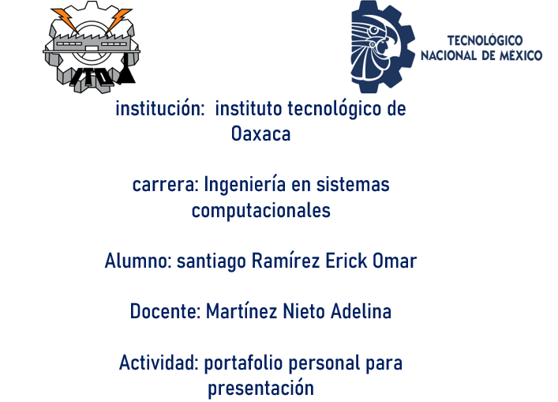

# Portafolio-Web

link de la plantilla: https://bootstrapmade.com/devfolio-bootstrap-portfolio-html-template/

Thanks for downloading this template!

Template Name: DevFolio
Template URL: https://bootstrapmade.com/devfolio-bootstrap-portfolio-html-template/
Author: BootstrapMade.com
License: https://bootstrapmade.com/license/

para usar la plantilla solo tienes que abrir el enlace en el navegador, seleccionamos el boton de download y seleccionamos la opcion gratuita

Este proyecto consiste en el desarrollo de un portafolio web profesional utilizando Bootstrap 5 como framework CSS, tomando como base la plantilla DevFolio de BootstrapMade.

El objetivo fue personalizar completamente la plantilla para crear un sitio web que representara mi portafolio, personalizandolo para que contenga nuestra informacion

esta platillacuneta con el area de informacion perosna/ acerca de mí, en donde ingrese mis datos basicos , nombre y perfil asi como como las skill o tecnologias que he utilizado 

Framework utilizado:

    Bootstrap 5.3
    HTML5
    CSS3
    JavaScript

Plantilla utilizada:

DevFolio - BootstrapMade

# estructura del proyecto

area de de desarrollo, donde ingresamo un resumen de nosotros y la educación en la experiencia personal 